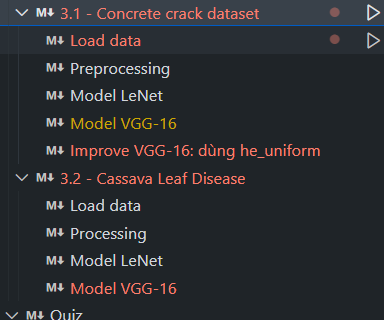
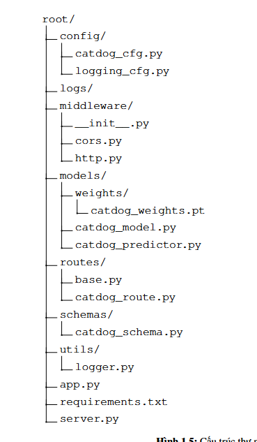

# Convolutional Neural Network 
## Mục tiêu
- Tìm hiểu về **Convolutional Neural Network** (CNN) và cách hoạt động của nó.

- Tìm hiểu về các kiến thức liên quan đến **Convolutional Neural Network** (CNN) như: 
  - Convolution
  - Pooling
  - Flattening
  - Fully Connected Layer
  - Activation Function
  - Loss Function
  - Optimizer

## Nhiệm vụ tuần này
- **Mục tiêu**: Tự thiết lập lại bài toán **Convolutional Neural Network** (CNN) với bài toán phân loại ảnh, xây dựng fastapi để serving model với hai bài toán này .
    - /api/v1/concrete
        - Input: 
            - Image
        - Output:
            - Class
    - /api/v1/leaf
        - Input: 
            - Image
        - Output:
            - Class
- Thiết kế cấu trúc folder dựa theo thư mục này 

## Note
**Ta sẽ có một buổi meet vào lúc 8:30 tối thứ sáu ngày (25/04/2025) nhé**